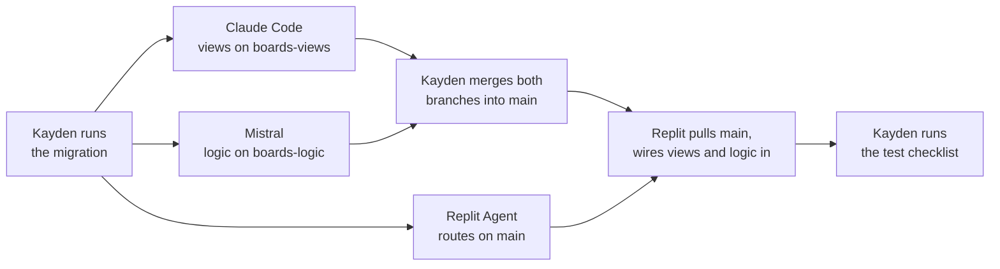

# Boards Feature Spec

Sep 30, 2026 · @Kayden

## Scope

This spec covers **only the boards feature**: public, Reddit-style boards where users post questions. Every agent must read the whole file, then work only on the phase and the files assigned to it in [Agent roles](#agent-roles). If a task seems to need something outside that, stop and ask Kayden instead of building it.

| Phase | Adds | Status |
| --- | --- | --- |
| Phase 1 | Boards: create, view, edit, delete; posting questions into boards; home feed of board questions; migration files | Build now |
| Phase 2 | Moderation: subscriptions, subscriber-only posting, mods, pinning, removing posts with a reason, My feed | Only after Phase 1 passes its tests |

Phase 2 is described here so Phase 1 code doesn't block it, but **no agent builds any Phase 2 feature during Phase 1.**

**Not part of this spec:** votes, search, and the paused studybot integration (Phase 6b in `SPEC-rooms-studybot.md`). Study rooms already exist and must keep working unchanged.

## Current app

Read the existing code before writing anything, and match its structure, naming, and module style (check `package.json` for `"type": "module"` versus CommonJS).

- **Stack:** Node.js, Express, EJS (server-rendered), `mysql2/promise` pool in `db.js`, `bcrypt`, `express-session`, port 5000, hosted on Replit
- **Database:** MySQL on Hostinger, database `u237055794_394964`
- **Existing tables:** `QA1_Users`, `QA1_Questions`, `QA1_Answers`, `QA1_Rooms`, `QA1_RoomMembers`. The `studybot` user row exists.
- **Key existing columns:** `QA1_Users.uid_user`, `QA1_Users.uName`; `QA1_Questions.question_id`, `uid_user`, `room_id` (NULL means not in a room), `title`, `body`, `created_at`, `updated_at`; `QA1_Answers.answer_id`, `question_id`, `uid_user`, `body`

**Rules that apply to all new code**

- Every query uses `?` placeholders. Never build SQL by joining strings with user input.
- The user ID always comes from the session, never from a form field or URL.
- Permission checks happen on the server for every POST route, not just by hiding buttons.
- User text is output with `<%= %>`, never `<%- %>`.
- Room privacy rules stay exactly as they are: non-members get a 404 on room questions.

## Agent roles

Three agents work in parallel in each phase. Each one owns a separate set of files, so they never edit the same file.

|  | Replit Agent | Claude Code | Mistral |
| --- | --- | --- | --- |
| Job | Routes, SQL queries, wiring everything together, testing against the real database | EJS views and CSS for new board pages | Pure logic: validation and permission helpers, with unit tests |
| Branch | `main` | `boards-views` | `boards-logic` |
| Owns (may create or edit) | `routes/`, `db.js`, `app.js`, all **existing** views, the shared header and layout, `package.json` | New files in `views/boards/` and `views/partials/boards/`, plus `public/css/boards.css` | `lib/boards/` and `tests/boards/` only |
| Uses secrets or database | Yes | No | No |
| Tests with | The real app in Replit | Sample data passed to the views | `node --test` |

**Rules for all three**

- Never edit a file another agent owns. If you need a change there, stop and say what's needed.
- Never create, alter, or drop database tables, and never run migration files. Kayden runs migrations by hand.
- Don't install packages or edit `package.json` (Replit Agent may, if truly needed, and must say why).
- Follow the contracts in this spec exactly: function names, arguments, return shapes, and view variable names. They are how the three parts fit together.
- Commit messages start with the phase and agent, like `Boards P1 (Mistral): add validateBoardInput`.

**Order within each phase**



While its branches aren't merged yet, Replit Agent may write routes that call the logic functions and render the views by the names in the contracts. It must not write its own versions of them.

## Migrations

Every database change is saved as a numbered SQL file in `migrations/` at the repo root. Running the files in number order builds the database from nothing. Kayden runs them by hand in phpMyAdmin; the app and the agents never run them.

```
migrations/
  001_create_users.sql                  already applied (baseline)
  002_create_questions_answers.sql      already applied (baseline)
  003_create_rooms.sql                  already applied (baseline)
  004_add_studybot_user.sql             already applied (baseline)
  005_create_boards.sql                 Phase 1 — run once
  005_create_boards.down.sql            undo for 005, only if needed
  006_board_moderation.sql              Phase 2 — created when Phase 2 starts
  006_board_moderation.down.sql
```

- **Baseline files (001–004)** record how the existing tables were made. They're already applied, so they are never run against the current database.
- **Up files** make a change. **Down files** undo it, in reverse order.
- Constraints and foreign keys added by 005 onward are **named** (like `fk_questions_board`), so the down file can drop them by name.
- A migration file is never edited after it's been run. A new change gets a new number.
- **Before running any up file, back up:** phpMyAdmin → Export → Quick → SQL → Go.

The files contain two kinds of changes: **schema** changes (tables and columns) and **data** changes (like moving existing questions into the General board). Both are part of the migration.

## Phase 1 database

Migration `005_create_boards.sql` makes four changes, in this order:

1. **New table `QA1_Boards`**

| Column | Type | Notes |
| --- | --- | --- |
| `board_id` | INT(10) | Primary key, auto-increment |
| `name` | VARCHAR(30) | Unique URL handle, stored lowercase (`/b/apeuro`) |
| `title` | VARCHAR(100) | Display name ("AP European History") |
| `description` | VARCHAR(500) | Optional |
| `rules` | TEXT | Optional; one rule per line |
| `creator_id` | INT(10) | Foreign key `fk_boards_creator` → `QA1_Users.uid_user`, cascade on delete |
| `created_at` | DATETIME | Defaults to now |

2. **`QA1_Questions` gets `board_id`** INT(10), nullable, after `room_id`. Foreign key `fk_questions_board` → `QA1_Boards.board_id`; deleting a board deletes its questions (and their answers, through the existing cascade).
3. **General board:** created with Kayden as creator, and every existing question with `room_id IS NULL` is moved into it.
4. **Constraint `chk_room_or_board`:** every question has a `room_id` or a `board_id`, never both and never neither. The database rejects any insert that breaks this.

**Important for the app:** once 005 runs, the old public "new question" route fails, because a question with no room and no board is rejected. Run 005 right before Replit Agent starts Phase 1, which moves public posting into boards.

The down file removes the constraint, the foreign key, the column, and the table. Undoing it loses which board each question was in, so restore the backup instead if Phase 1 data matters.

## Phase 1 app

### Routes (Replit Agent)

| Method | Route | Who | What it does |
| --- | --- | --- | --- |
| GET | `/` | Anyone | Feed of all board questions, newest first, showing each question's board |
| GET | `/boards` | Anyone | List all boards with question counts; "Create board" button if logged in |
| GET | `/boards/new` | Logged in | Create board form |
| POST | `/boards` | Logged in | Validate, insert, redirect to `/b/:name` |
| GET | `/b/:name` | Anyone | Board title, description, numbered rules, its questions newest first |
| GET | `/b/:name/questions/new` | Logged in | New question form for this board |
| POST | `/b/:name/questions` | Logged in | Insert question with this `board_id` (and `room_id` NULL) |
| GET | `/b/:name/edit` | Creator | Edit title, description, rules (name can't change) |
| POST | `/b/:name/edit` | Creator | Validate and save |
| GET | `/b/:name/delete` | Creator | Confirmation page showing how many questions will be deleted |
| POST | `/b/:name/delete` | Creator | Delete the board; its questions and answers cascade |

- The old `/questions/new` redirects to `/b/general/questions/new`, so old links still work.
- The question page (`/questions/:id`) shows a link back to its board. Answer routes don't change.
- An unknown board name gives a 404. Board names in URLs are matched lowercase.
- The General board can't be deleted.
- Add a **Boards** link to the shared header.

### Logic module contract (Mistral)

File `lib/boards/index.js`. No database, no Express, no packages: plain objects in, plain values out.

| Export | Input | Returns |
| --- | --- | --- |
| `validateBoardInput(input, { isEdit })` | `{ name, title, description, rules }` | `{ ok: true, value }` with trimmed values and `name` lowercased, or `{ ok: false, errors }` where `errors` maps field name to a message. When `isEdit` is true, `name` is ignored. |
| `parseRules(text)` | Rules text or `null` | Array of non-empty, trimmed lines, in order (empty array for none) |
| `canEditBoard(userId, board)` | Session user ID (or `undefined`), `{ creator_id }` | `true` only if logged in and the creator |
| `canDeleteBoard(userId, board)` | Same, plus `board.name` | Same as `canEditBoard`, but always `false` for `general` |

Validation rules:

| Field | Rule |
| --- | --- |
| `name` | 3–30 characters; lowercase letters, digits, and underscores only (uppercase is lowercased first); not one of `new`, `edit`, `delete`, `admin`, `settings`, `mod`, `api` |
| `title` | 1–100 characters after trimming |
| `description` | Optional, up to 500 characters |
| `rules` | Optional, up to 5,000 characters |

Empty optional fields become `null` in `value`. Duplicate names are caught by the database, not this module; Replit shows "That board name is taken" on `ER_DUP_ENTRY`.

### View contract (Claude Code)

Every view also receives `user` (the logged-in user, or `null`) and uses the existing layout and header. Dates arrive as JavaScript `Date` objects.

| View file | Variables it receives |
| --- | --- |
| `views/boards/index.ejs` | `boards`: array of `{ name, title, description, question_count }` |
| `views/boards/form.ejs` | `mode` (`'create'` or `'edit'`), `values` (`{ name, title, description, rules }`), `errors` (field → message, may be empty), `board` (only in edit mode) |
| `views/boards/show.ejs` | `board`: `{ name, title, description, rules_list, creator_uName, created_at }`; `questions`: array of `{ question_id, title, uName, created_at, answer_count }`; `canEdit`, `canDelete` (booleans) |
| `views/boards/new-question.ejs` | `board` (`{ name, title }`), `values` (`{ title, body }`), `errors` |
| `views/boards/delete.ejs` | `board` (`{ name, title }`), `question_count` |

`rules_list` is the output of `parseRules`, shown as a numbered list. Forms post to the routes above. Edit and Delete buttons appear only when `canEdit` / `canDelete` is true. Claude Code includes a small sample-data script or notes showing each view renders with empty and filled data.

The home feed (`/`) uses the existing home view, which Replit Agent updates.

## Phase 2 database

Migration `006_board_moderation.sql`, run only when Phase 2 starts. Planned contents:

```sql
CREATE TABLE QA1_BoardMembers (
  board_id INT(10) NOT NULL,
  uid_user INT(10) NOT NULL,
  role ENUM('subscriber','mod','owner') NOT NULL DEFAULT 'subscriber',
  joined_at DATETIME NOT NULL DEFAULT CURRENT_TIMESTAMP,
  PRIMARY KEY (board_id, uid_user),
  CONSTRAINT fk_members_board FOREIGN KEY (board_id) REFERENCES QA1_Boards(board_id) ON DELETE CASCADE,
  CONSTRAINT fk_members_user FOREIGN KEY (uid_user) REFERENCES QA1_Users(uid_user) ON DELETE CASCADE
) ENGINE=InnoDB DEFAULT CHARSET=utf8mb4 COLLATE=utf8mb4_unicode_ci;

ALTER TABLE QA1_Questions
  ADD is_pinned TINYINT(1) NOT NULL DEFAULT 0,
  ADD removed_reason VARCHAR(200) NULL,
  ADD removed_by INT(10) NULL,
  ADD CONSTRAINT fk_questions_removed_by FOREIGN KEY (removed_by) REFERENCES QA1_Users(uid_user) ON DELETE SET NULL;

ALTER TABLE QA1_Answers
  ADD removed_reason VARCHAR(200) NULL,
  ADD removed_by INT(10) NULL,
  ADD CONSTRAINT fk_answers_removed_by FOREIGN KEY (removed_by) REFERENCES QA1_Users(uid_user) ON DELETE SET NULL;

-- Every board's creator becomes its owner
INSERT INTO QA1_BoardMembers (board_id, uid_user, role)
SELECT board_id, creator_id, 'owner' FROM QA1_Boards;

-- Every other existing user (except studybot) subscribes to General
INSERT IGNORE INTO QA1_BoardMembers (board_id, uid_user, role)
SELECT b.board_id, u.uid_user, 'subscriber'
FROM QA1_Boards b CROSS JOIN QA1_Users u
WHERE b.name = 'general' AND u.uName <> 'studybot';
```

- One row per user per board. `role` says what they are there: `subscriber`, `mod`, or `owner`. Mods and owners count as subscribers.
- `removed_by` uses `ON DELETE SET NULL`: if the mod's account is deleted, the removal stays and just loses who did it.
- `INSERT IGNORE` skips General's owner, who already has a row from the previous insert.
- `QA1_Boards.creator_id` stays as a record of who made the board; permissions in Phase 2 come from `role`.

The down file drops the three foreign keys, the five columns, and the table, in reverse order.

## Phase 2 app

### Permissions

A user's role in a board comes from `QA1_BoardMembers`. No row means `none`.

| Action | none | subscriber | mod | owner |
| --- | --- | --- | --- | --- |
| View board and its questions | ✓ | ✓ | ✓ | ✓ |
| Post questions and answers |  | ✓ | ✓ | ✓ |
| Edit or delete own posts | ✓ | ✓ | ✓ | ✓ |
| Remove others' posts with a reason |  |  | ✓ | ✓ |
| Pin and unpin questions |  |  | ✓ | ✓ |
| Edit title, description, rules |  |  |  | ✓ |
| Add and remove mods |  |  |  | ✓ |
| Delete the board |  |  |  | ✓ (not General) |

The owner can't unsubscribe, be demoted, or be removed. A mod can't change other mods. "Edit or delete own posts" doesn't depend on role, so someone who unsubscribes can still delete what they wrote.

### Routes (Replit Agent)

| Method | Route | Who | What it does |
| --- | --- | --- | --- |
| POST | `/b/:name/subscribe` | Logged in | Add a `subscriber` row (do nothing if one exists) |
| POST | `/b/:name/unsubscribe` | Subscriber or mod | Delete own row; owner is refused |
| GET | `/feed` | Logged in | Questions from boards the user belongs to, newest first, pinned not special |
| GET | `/b/:name/mods` | Owner | List of mods and a form to add a mod by username |
| POST | `/b/:name/mods` | Owner | Promote a subscriber to `mod`; if the user isn't subscribed, show an error |
| POST | `/b/:name/mods/:uid/remove` | Owner | Change a mod back to `subscriber` |
| POST | `/questions/:id/remove` | Mod or owner of its board | Remove with a reason |
| POST | `/answers/:id/remove` | Mod or owner of its question's board | Remove with a reason |
| POST | `/questions/:id/pin` and `/unpin` | Mod or owner of its board | Set `is_pinned` to 1 or 0 |

Changes to Phase 1 routes: posting questions and answers in a board now requires subscriber or higher; board edit and delete checks switch from `creator_id` to the `owner` role; the board page lists pinned questions first, then newest; creating a board also inserts the creator as `owner`; registering a new user also subscribes them to General. Room questions are unaffected.

### Removing a post

One `UPDATE` inside the removal route:

- Question: `title = '[removed]'`, `body = ''`, `removed_reason = ?`, `removed_by = <session user>`, `is_pinned = 0`
- Answer: `body = ''`, `removed_reason = ?`, `removed_by = <session user>`

The original text is erased from the database for good. The row stays, so its spot shows "Removed by a moderator for: \<reason>". Answers under a removed question stay visible. A removed question gets no new answers, and removed posts can't be edited; the author can still delete them.

### Logic module contract (Mistral)

Added to `lib/boards/index.js`. Phase 1 exports stay and keep working.

| Export | Input | Returns |
| --- | --- | --- |
| `can(action, role)` | `action` from the list below; `role` one of `'none'`, `'subscriber'`, `'mod'`, `'owner'` | `true` or `false`, exactly per the permissions table |
| `validateRemovalReason(text)` | Any string | `{ ok: true, value }` trimmed, 3–200 characters, or `{ ok: false, error }` |
| `canChangeMod(actorRole, targetRole)` | Two roles | `true` only if the actor is `owner` and the target is `subscriber` or `mod` |

Actions: `'post'`, `'remove'`, `'pin'`, `'editBoard'`, `'manageMods'`, `'deleteBoard'`. An unknown action or role returns `false`. `can('deleteBoard', 'owner')` is `true`; the General check stays in `canDeleteBoard`.

### View contract (Claude Code)

| View file | Variables it receives |
| --- | --- |
| `views/partials/boards/subscribe-button.ejs` | `board` (`{ name }`), `role` |
| `views/partials/boards/mod-tools.ejs` | `type` (`'question'` or `'answer'`), `id`, `is_pinned` (questions only) — a pin/unpin button and a remove form with a reason field |
| `views/partials/boards/removed-post.ejs` | `removed_reason` |
| `views/boards/mods.ejs` | `board` (`{ name, title }`), `mods` (array of `{ uid_user, uName, joined_at }`), `owner` (`{ uName }`), `errors` |
| `views/boards/feed.ejs` | `questions` (same shape as `show.ejs`, plus `board_name` and `board_title`) |

`show.ejs` gains `role`, and each question gains `is_pinned` and `removed_reason`; pinned questions show a pin label, and removed ones use `removed-post.ejs`. Replit Agent includes the partials in the existing question page.

## Test checklists

Use three accounts (A, B, C) and a logged-out window. Every box passes before the next phase starts.

**Phase 1**

- [ ] After running 005: `QA1_Boards` has the General board, and every old public question has its `board_id`
- [ ] Mistral: `node --test tests/boards/` passes, including bad names (`ab`, `New`, `has space`, 31 characters)
- [ ] A creates board `apeuro`; typing `APEuro` as the name saves it as `apeuro`
- [ ] Creating a second board named `apeuro` shows "That board name is taken"
- [ ] Rules typed on separate lines show as a numbered list on `/b/apeuro`
- [ ] B posts a question in `apeuro`; it shows on the board and on the home feed with the board's name
- [ ] `/questions/new` redirects to the General board's form
- [ ] B can't open `/b/apeuro/edit` or `/b/apeuro/delete`, even by typing the URL
- [ ] A deletes `apeuro` after the confirmation page; its questions and answers are gone in phpMyAdmin
- [ ] Nobody can delete General
- [ ] Rooms still work: room questions don't appear on the home feed or any board
- [ ] In phpMyAdmin, inserting a question with both `room_id` and `board_id` set is rejected by `chk_room_or_board`

**Phase 2**

- [ ] After running 006: each board's creator is its `owner`, and existing users are subscribed to General
- [ ] Mistral: `can()` matches every cell of the permissions table in tests
- [ ] A newly registered user is automatically subscribed to General
- [ ] C, not subscribed to a board, can view it but gets refused when posting a question or answer there
- [ ] C subscribes, then can post; `/feed` shows that board's questions
- [ ] The owner can't unsubscribe from their own board
- [ ] A (owner) makes B a mod; B removes C's question with reason "Rule 2: no homework dumps"
- [ ] In phpMyAdmin the question's title is `[removed]`, the body is empty, and the reason and `removed_by` are filled in
- [ ] The removed question's page shows the reason, and its answers are still visible; no new answers can be added
- [ ] B pins a question; it appears first on the board
- [ ] B can't open `/b/:name/mods` or change the board's rules
- [ ] A removes B as mod; B can no longer remove or pin

## Out of scope

No agent builds these, in either phase: votes, search, the studybot integration, boards inside rooms, private boards, banning users, reports from users, editing a board's `name`, transferring ownership, removal appeals, and a migration runner script. If any of these seems necessary, stop and ask Kayden.
