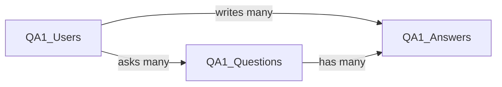

# Q&A CRUD App — Spec

2026-09-22 · @Someone

## Overview

A simple Q&A website where users sign up, post questions, and answer each other. The goal is to learn database design and CRUD, not to build a production product.

The app is done when a user can:

1. Register, log in, and log out
2. Post, edit, and delete their own questions
3. Post, edit, and delete their own answers
4. See all questions (newest first) and all answers on a question, with author usernames

## Tech stack

Server-rendered Node app on Replit, connecting to the existing MySQL database on Hostinger.

| Piece | Choice | Why |
| --- | --- | --- |
| Runtime | Node.js + Express | Simple routing, familiar |
| Database driver | `mysql2/promise` | Supports `?` placeholders and connection pools |
| Views | EJS templates | Pages rendered on the server; no frontend framework needed |
| Styling | Plain CSS (one file) | Keeps focus on the database |
| Passwords | `bcrypt` | Hashes passwords before saving |
| Login state | `express-session` | Stores the logged-in user's ID |
| Config | Replit Secrets | Keeps DB credentials out of the code |

No ORM (like Prisma or Sequelize). All queries are written as raw SQL so the database concepts stay visible.

## Environment and secrets

All credentials live in Replit Secrets and are read with `process.env`. Nothing sensitive is written in code or committed to GitHub.

| Secret name | Value |
| --- | --- |
| `DB_HOST` | Remote MySQL hostname from Hostinger (not `127.0.0.1`) |
| `DB_PORT` | `3306` |
| `DB_USER` | Database username |
| `DB_PASSWORD` | Database password |
| `DB_NAME` | `u237055794_394964` |
| `SESSION_SECRET` | Long random string used to sign session cookies |

**Remote access:** phpMyAdmin shows the server as `127.0.0.1` because it runs on the same machine as the database. Replit is a different machine, so:

- In Hostinger hPanel, open **Databases → Remote MySQL** and add an allowed host. Replit's IP changes, so use `%` (any host) for this project.
- Use the hostname Hostinger shows on that page as `DB_HOST`.

**Connection:** create one `mysql2` connection pool in `db.js` when the app starts, and reuse it for every query. Log a clear error if the connection fails at startup.

## Database schema

Three tables. `QA1_Users` already exists; the other two are created with the SQL below. The agent must use these exact table and column names, including capitalization.



Each arrow is a foreign key: questions store the asker's `uid_user`, and answers store both `question_id` and `uid_user`.

**QA1\_Users** (existing)

| Column | Type | Notes |
| --- | --- | --- |
| `uid_user` | INT(10) | Primary key, auto-increment |
| `uName` | VARCHAR(25) | Unique |
| `password` | VARCHAR(255) | Stores a bcrypt hash, never plain text |
| `email` | VARCHAR(255) | Unique |
| `registerdate` | DATETIME | No default; the app must insert `NOW()` |

**QA1\_Questions** and **QA1\_Answers**

```sql
CREATE TABLE QA1_Questions (
  question_id INT(10) NOT NULL AUTO_INCREMENT,
  uid_user INT(10) NOT NULL,
  title VARCHAR(150) NOT NULL,
  body TEXT NOT NULL,
  created_at DATETIME NOT NULL DEFAULT CURRENT_TIMESTAMP,
  updated_at DATETIME NULL DEFAULT NULL ON UPDATE CURRENT_TIMESTAMP,
  PRIMARY KEY (question_id),
  FOREIGN KEY (uid_user) REFERENCES QA1_Users(uid_user) ON DELETE CASCADE
) ENGINE=InnoDB DEFAULT CHARSET=utf8mb4 COLLATE=utf8mb4_unicode_ci;

CREATE TABLE QA1_Answers (
  answer_id INT(10) NOT NULL AUTO_INCREMENT,
  question_id INT(10) NOT NULL,
  uid_user INT(10) NOT NULL,
  body TEXT NOT NULL,
  created_at DATETIME NOT NULL DEFAULT CURRENT_TIMESTAMP,
  updated_at DATETIME NULL DEFAULT NULL ON UPDATE CURRENT_TIMESTAMP,
  PRIMARY KEY (answer_id),
  FOREIGN KEY (question_id) REFERENCES QA1_Questions(question_id) ON DELETE CASCADE,
  FOREIGN KEY (uid_user) REFERENCES QA1_Users(uid_user) ON DELETE CASCADE
) ENGINE=InnoDB DEFAULT CHARSET=utf8mb4 COLLATE=utf8mb4_unicode_ci;
```

The tables are created by hand in phpMyAdmin. The app never creates, alters, or drops tables.

## Pages and routes

HTML forms only support GET and POST, so edits and deletes use POST routes.

| Method | Route | Login needed | What it does |
| --- | --- | --- | --- |
| GET | `/` | No | List all questions, newest first, with author and answer count |
| GET | `/register` | No | Sign-up form |
| POST | `/register` | No | Hash password, insert user with `registerdate = NOW()` |
| GET | `/login` | No | Login form |
| POST | `/login` | No | Check bcrypt hash, save `uid_user` in session |
| POST | `/logout` | Yes | Destroy session, redirect to `/` |
| GET | `/questions/new` | Yes | New question form |
| POST | `/questions` | Yes | Insert question, redirect to it |
| GET | `/questions/:id` | No | Question, its answers (oldest first), answer form if logged in |
| GET | `/questions/:id/edit` | Owner | Edit question form |
| POST | `/questions/:id/edit` | Owner | Update title and body |
| POST | `/questions/:id/delete` | Owner | Delete question (answers cascade) |
| POST | `/questions/:id/answers` | Yes | Insert answer |
| GET | `/answers/:id/edit` | Owner | Edit answer form |
| POST | `/answers/:id/edit` | Owner | Update answer body |
| POST | `/answers/:id/delete` | Owner | Delete answer |

Every page shares a header with the site name, and either Login/Register or the username with a Logout button. Edit and Delete buttons only appear on the user's own posts.

## Rules

These are requirements, not suggestions. The agent must follow all of them.

**Security**

- Every query uses `?` placeholders. Never build SQL by joining strings with user input.
- Passwords are hashed with bcrypt (10 salt rounds) before insert. Plain-text passwords are never stored or logged.
- Login failures show one message, "Invalid username or password," without saying which part was wrong.
- EJS output uses `<%= %>` (escaped), never `<%- %>`, for anything a user typed.

**Ownership**

- Routes marked "Yes" redirect to `/login` if there is no session.
- Update and delete queries include `AND uid_user = ?` with the session's user ID. If no row is affected, return 403.
- The user ID always comes from the session, never from a form field.

**Validation**

| Field | Rule |
| --- | --- |
| Username | 3–25 characters, must be unique |
| Email | Valid format, max 255, must be unique |
| Password | At least 8 characters |
| Question title | 1–150 characters |
| Question or answer body | Not empty |

On a validation error, re-show the form with the error message and the user's input kept. A duplicate username or email (MySQL error `ER_DUP_ENTRY`) shows a friendly message instead of crashing.

## Build plan

Build in four phases. Give the agent this whole doc first, then ask for one phase at a time and test before moving on.

1. **Setup and connection**
   - Express app, EJS, `db.js` pool reading from Replit Secrets
   - Startup check that runs `SELECT 1` and logs success or the error
   - Test: app starts and logs "Connected to MySQL"
2. **Auth**
   - Register, login, logout, session middleware, shared header
   - Test: new row appears in `QA1_Users` in phpMyAdmin with a hash starting `$2b$`
3. **Questions CRUD**
   - Home list, new, view, edit, delete
   - Test: a second account cannot edit or delete the first account's question
4. **Answers CRUD**
   - Answer form on question page, edit, delete
   - Test: deleting a question removes its answers in phpMyAdmin

**Suggested first prompt:** "Read this spec. Build Phase 1 only. Do not create or modify any database tables; they already exist."

## Out of scope

Not in this version, so the agent should not add them: search, tags, voting, accepted answers, profile pages, password reset, email verification, file uploads, pagination, and an admin panel.

Good next steps after it works, each teaching a new database idea:

- **Votes table:** composite primary key `(uid_user, answer_id)` stops double voting
- **Search:** `WHERE title LIKE ?` and later a FULLTEXT index
- **Pagination:** `LIMIT` and `OFFSET` on the home page
